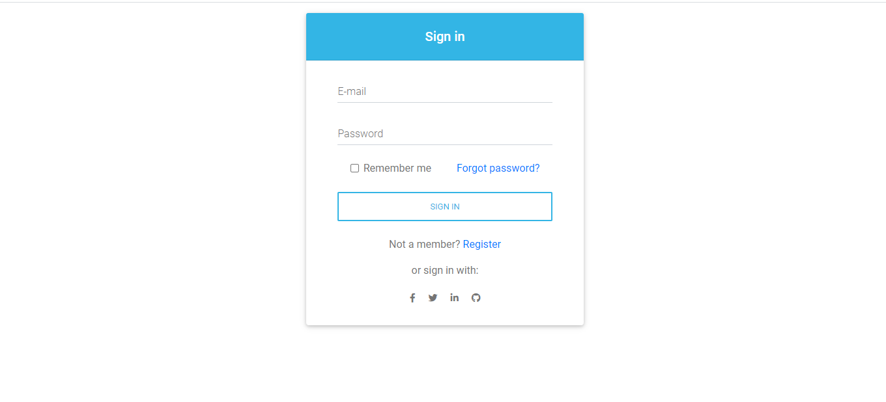
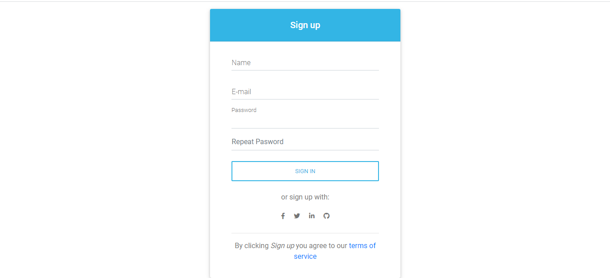
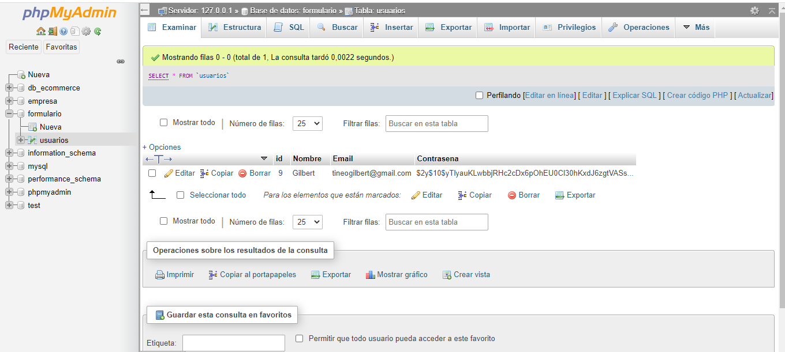

# Formulario de Registro y Login de Usuario
 
Este proyecto se basa en un registro y login de usuario de forma sencilla,
en donde cada información es guardada en una Base de Datos. Está estructurado
en un código simple y facil de entender, con la finalidad de que si alguna persona
no tiene mucho conocimiento o no entiende acerca de lo que son las conexiones y las "Sesiones en PHP",
pueda quizás tener una mejor ídea de como traban estas funciones. Se puede mejorar mucho más este tipo
de Formulario, pero en este proyecto no es el caso.

## Tecnologías Utilizadas

- HTML
- PHP
- MDBOOTSTRAP

